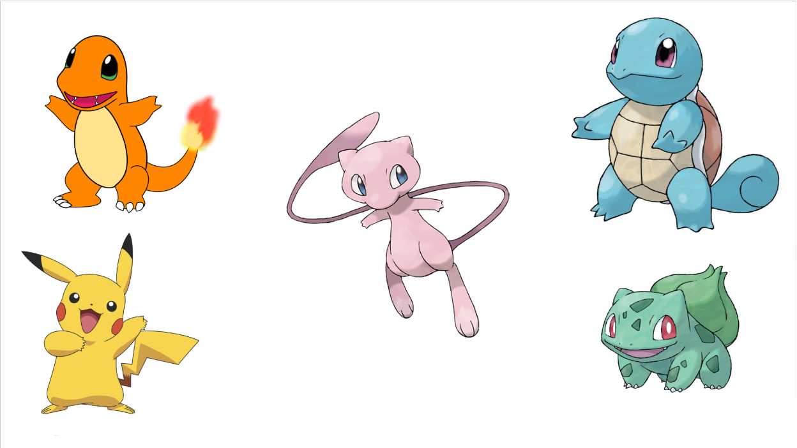

# **Pokemon**

## **Introduction**

This project is a Pokemon game created using the PyGame library of Python.
You will choose between four starter pokemons and run battle against
wild pokemons. Each wild pokemon killed will enter your pokedex but if your pokemon
loose the battle it will be lost, and you can't use it again.
You have also an option to show your pokedex and add other pokemons to the game.

- Language used: Python
- Libraries used: PyGame, json, math, os, random

## **Installation**

To install Pokemon, follow these steps:

1. Clone this repository: **`git clone https://github.com/thibault-caron/pokemon`**, or download the folder as a zip file ("code" button on GitHub)
2. Download the Python language: **https://www.python.org/downloads/**
3. Install the PyGame library: **`pip install pygame`**
4. Navigate to the project directory: **`cd pokemon`**

## **Usage**

To use Pokemon, follow these steps:

1. Open the computer terminal.
2. Navigate to the project directory: **`cd pokemon`**
3. Launch the app.py file: **`py app.py`** or **`python app.py`** or **`python3 app.py`**
4. Play the game.

## **License**

Pokemon is released under the Apache-2.0 License. 
See the **[LICENSE](http://www.apache.org/licenses/LICENSE-2.0)** file for details.

## **Authors and Acknowledgment**

Pokemon was created by :

- **[Thibault CARON](https://github.com/thibault-caron)**
- **[Lorenzo OTTAVIANI](https://github.com/lorenzo-ottaviani)**
- **[Olivier PORTAL](https://github.com/olivier-portal)**

Thank you to all the contributors for their hard work and dedication to the project.
